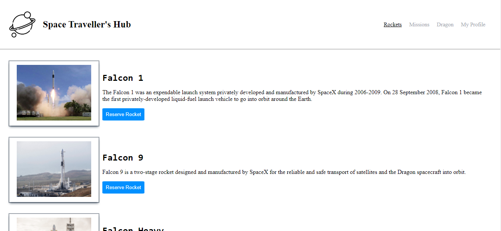

# Space Traveller hub

Space Traveller hub is a web application that works with the real live data from the SpaceX API. It's a web application for a company that provides commercial and scientific space travel services. The application will allow users to book rockets and dragons and join selected space missions.

# Screenshot:

## Built With

- Major languages: JAVASCRIPT | HTML | CSS 
- Major Library: ReactJS
- Technologies used : Git | Github | Linter | Jest

## Live Demo

[Live link]()

# Getting Started with Create React App

This project was bootstrapped with [Create React App](https://github.com/facebook/create-react-app).
To have the local version of this project in your local PC, first clone the project with: `git clone` https://github.com/RolandM99/SpaceTraveller.git,
then run the command `npm install` to update all packages locally.

## Available Scripts

In the project directory, you can run:

### `npm start`

Runs the app in the development mode.\
Open [http://localhost:3000](http://localhost:3000) to view it in your browser.

The page will reload when you make changes.\
You may also see any lint errors in the console.

### `npm test`

Launches the test runner in the interactive watch mode.\
See the section about [running tests](https://facebook.github.io/create-react-app/docs/running-tests) for more information.

### `npm run build`

Builds the app for production to the `build` folder.\
It correctly bundles React in production mode and optimizes the build for the best performance.

The build is minified and the filenames include the hashes.\
Your app is ready to be deployed!
See the section about [deployment](https://facebook.github.io/create-react-app/docs/deployment) for more information.

👤 **Authors:** 

👤**Roland Manful Mweze**

- GitHub: [Rolandm99](https://github.com/RolandM99)
- Twitter: [@Manfulmwez](https://twitter.com/ManfulMwez)
- LinkedIn: [Roland N. MWEZE](https://www.linkedin.com/in/roland-n-mweze-8b1045189/)

👤 **Zachee Ishimwe**

- GitHub: [@ishimwezachee](https://github.com/ishimwezachee)
- Twitter: [@zachee250](https://twitter.com/zachee250)
- LinkedIn: [@zacheeishimwe](https://www.linkedin.com/in/zachee-ishimwe-ab952a119/)

👤 **Hamza Tarar**

- GitHub: [@Lockless404](https://github.com/Lockless404)
- Twitter: [@hamza_tarar10](https://twitter.com/hamza_tarar10)
- LinkedIn: [Hamza Tarar](https://www.linkedin.com/in/hamza-tarar-639685216/)

## 🤝 Contributors

Contributions, issues, and feature requests are welcome!

Feel free to check the [issues page](../../issues/).

## Show your support

Give a ⭐️ if you like this project!
